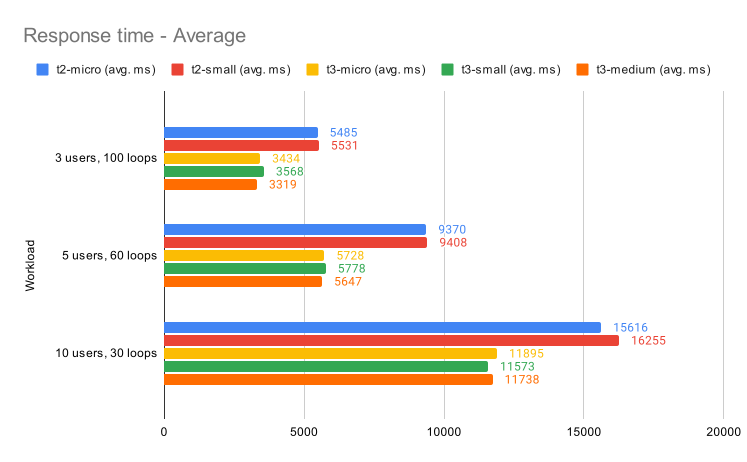
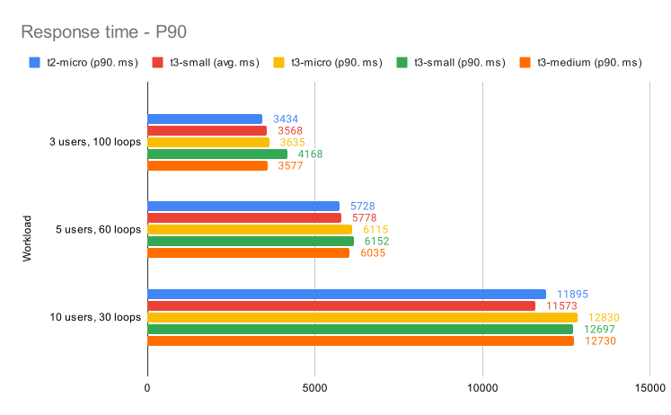
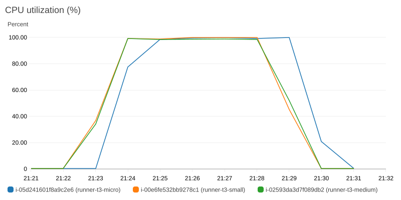

# Relatório de Performance em Nuvem

## Introdução

O relatório de performance apresentado nas entregas 3 e 4 foram realizados em um ambiente local, porém com configurações de hardware e software muito diferentes do que é encontrado em um ambiente de produção. Para que seja possível realizar uma análise mais próxima do que é encontrado em um ambiente de produção, foi realizada uma migração do sistema para a nuvem, utilizando o serviço de hospedagem da Amazon Web Services (AWS).

O provedor AWS foi escolhido devido à minha familiaridade com seus serviços. No entanto, é importante notar que os testes podem ser realizados em qualquer outro provedor de nuvem, como o Google Cloud Platform (GCP) ou Microsoft Azure, desde que as configurações de hardware sejam equivalentes.

## Configuração dos servidores

Os servidores de aplicação são máquinas virtuais (VMs) que possuem o sistema operacional Ubuntu 20.04.2 LTS. Foi utilizado o serviço EC2 para provisionar estas máquinas. Os valores de vCPUs e memória na tabela abaixo representam os recursos atribuídos a cada instância do servidor.

| Instância | vCPUs | Memória (GiB) |
| --------- | ----- | ------------ |
| t2.micro  | 1     | 1            |
| t2.small  | 1     | 2            |
| t3.micro  | 2     | 1            |
| t3.small  | 2     | 2            |
| t3.medium | 2     | 4            |


### Configuração do servidor de aplicação

Para realizar os testes com diferentes configurações de máquina, foi criado um script Makefile que instala as dependências do projeto e configura a versão corrigida para concorrência do Tesfify. Abaixo está o procedimento para realizar a configuração do ambiente:

```makefile
install:
	sudo apt-get update -y 
	sudo apt-get install -y python3 python3-pip docker.io unzip
	sudo apt-get upgrade -y ca-certificates
	sudo service docker start
	sudo usermod -aG docker $USER

setup_project:
	sudo mkdir /app
	sudo chown ubuntu:adm /app
	wget https://github.com/hussani/runner/archive/refs/heads/fix-concurrency-files.zip
	unzip fix-concurrency-files
	mv runner-fix-concurrency-files/* /app
	cd /app
	sudo chmod +x *
	pip3 install -r requirements.txt
```

### Configuração do servidor executor de testes

Para o servidor que executa os testes de performance, foi utilizada uma instância t3.medium, que possui 2 vCPUs e 4 GiB de memória. Foi instalado o JDK 11 e o JMeter 5.5, que é a versão mais recente do JMeter no momento da escrita deste relatório.

## Resultados

Os workloads foram escolhidos para representar diferentes condições de uso, variando o número de usuários simultâneos e o número de iterações, para avaliar o desempenho da aplicação sob várias cargas de trabalho. Todas as configurações resultam em 300 amostras de requisições HTTP. As configurações são:

- 3 usuários simultâneos, 100 iterações;
- 5 usuários simultâneos, 60 iterações;
- 10 usuários simultâneos, 30 iterações.

Abaixo são apresentados os resultados dos testes de performance para cada configuração de hardware.



| Workload            | t2-micro (avg. ms) | t2-small (avg. ms) | t3-micro (avg. ms) | t3-small (avg. ms) | t3-medium (avg. ms) |
|---------------------|--------------------|--------------------|--------------------|--------------------|---------------------|
| 3 users, 100 loops  | 5485               | 5531               | 3434               | 3568               | 3319                |
| 5 users, 60 loops   | 9370               | 9408               | 5728               | 5778               | 5647                |
| 10 users, 30 loops  | 15616              | 16255              | 11895              | 11573              | 11738               |




| Workload            | t2-micro (p90. ms) | t2-small (p90. ms) | t3-micro (p90. ms) | t3-small (p90. ms) | t3-medium (p90. ms) |
|---------------------|--------------------|--------------------|--------------------|--------------------|---------------------|
| 3 users, 100 loops  | 5649               | 5660               | 3635               | 4168               | 3577                |
| 5 users, 60 loops   | 9668               | 9662               | 6115               | 6152               | 6035                |
| 10 users, 30 loops  | 17026              | 17864              | 12830              | 12697              | 12730               |


### Impressões sobre os resultados obtidos

Com base nos testes executados é possível afirmar que os testes realizados na família T3, com dois vCPUs tiveram performance superior aos realizados na família T2, com apenas um vCPU. A diferença de performance entre as famílias T2 e T3 é de aproximadamente 40% para o workload com 3 usuários simultâneos, 60% para o workload com 5 usuários simultâneos e 70% para o workload com 10 usuários simultâneos.

Com base nos dados coletados, a quantidade de memória RAM não parece ser um fator limitante para a performance do componente Runner, já que não há uma melhoria significativa no desempenho ao aumentar a memória RAM dentro da mesma família de instâncias

O uso de CPU na família T3 pode ser conferido na execução do workload de 10 usuários com 30 repetições pode ser visto na imagem abaixo:



Em todas as configurações de máquinas foi possível notar a degradação de performance do componente Runner com o aumento da carga de usuários. Porém ainda é possível ter uma boa experiência de uso da plataforma com até 5 usuários simultâneos, desde que as máquinas possuam 2 CPUs. A partir de 10 usuários simultâneos, a experiência de uso da plataforma começa a ser comprometida.


### Comparação com os resultados obtidos em ambiente local

Os resultados obtidos são consideravelmente diferentes do que foi obtido nos testes utilizando o ambiente local na entrega 4. Em testes com o mesmo workload, o tempo de resposta médio foi reduzido entre 45% e 73%, mesmo utilizando configurações de hardware inferiores. 

A diferença nos resultados entre os ambientes local e de nuvem pode ser explicada pelas peculiaridades da execução do Docker em ambientes OSX. O Docker no OSX requer uma camada adicional de virtualização e a necessidade de abstrair o sistema de arquivos, o que pode resultar em um desempenho inferior em comparação com outros sistemas operacionais.
