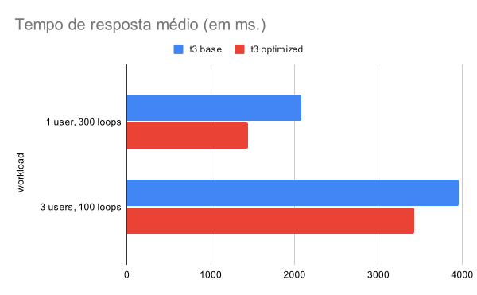

# Relatório de Instrumentação

## Introdução

Após realizar testes de benchmark com diferentes configurações de hardware, as da família T3 apresentaram melhor desempenho. Portanto, foi escolhida a configuração t3.micro para o servidor executor de testes. Esta configuração de hardware possui 2 vCPUs e 1 GiB de memória RAM.

Para identificar quais operações do sistema são mais custosas, foi utilizada a ferramenta PyInstrument para realizar a instrumentação do código. A ferramenta PyInstrument é um profiler de código Python que gera um relatório com o tempo de execução de cada função do programa. 

Pela dificuldade de isolar a operação de executar um teste unitário das demais operações do framework HTTP utilizado no sistema, foi criado um arquivo `profiler.py` que executa um teste unitário. O arquivo `profiler.py` é apresentado abaixo:

```python
from dependency_container import runnerService
from models.run_request import RunRequestBody


def run():
    body = RunRequestBody(
        testCommand="jest",
        files=[
            {"fileName": "sum.js",
             "content": "\"use strict\";\n\nfunction sum(a, b) {\n  return a + b;\n}\n\nmodule.exports = { sum };\n"},
            {"fileName": "sum.test.js",
             "content": "\"use strict\";\n\nconst { sum } = require(\"./sum.js\");\n\ntest(\"should return proper "
                        "result\", () => {\n  expect(sum(1, 1)).toBe(2);\n  expect(sum(-1, 1)).toBe(0);\n  expect("
                        "sum(-1, -1)).toBe(-2);\n});"}
        ],
        testingEnvironment="javascript-jest"
    )
    runnerService.run(body)


if __name__ == "__main__":
    run()
```


## Resultado da instrumentação

O resultado da instrumentação do código é apresentado abaixo:

```txt
Program: profiler.py

2.233 <module>  profiler.py:1
├─ 1.942 run  profiler.py:5
│  └─ 1.942 RunnerService.run  services/runner_service.py:24
│     └─ 1.942 RunnerService.runTestAndGetOutput  services/runner_service.py:46
│        ├─ 1.409 DockerContainer.stop  utils/docker_container.py:10
│        │  └─ 1.409 Container.stop  docker/models/containers.py:424
│        │        [30 frames hidden]  docker, requests, urllib3, http, sock...
│        │           1.407 socket.recv_into  None
│        ├─ 0.376 DockerService.runAndGetContainer  services/docker_service.py:28
│        │  └─ 0.376 ContainerCollection.run  docker/models/containers.py:518
│        │        [85 frames hidden]  docker, requests, urllib3, http, sock...
│        └─ 0.128 DockerService.pullImage  services/docker_service.py:24
│           └─ 0.128 ImageCollection.pull  docker/models/images.py:417
│                 [61 frames hidden]  docker, requests, urllib3, http, sock...
└─ 0.292 <module>  dependency_container.py:1
   ├─ 0.205 <module>  docker/__init__.py:1
   │     [592 frames hidden]  docker, requests, urllib3, six, http,...
   └─ 0.061 <module>  services/runner_service.py:1
      └─ 0.058 <module>  models/run_request.py:1
         └─ 0.028 [self]  None

```

Pelo resultado apresentado acima, é possível notar que algumas operações do Docker são chamadas sem necessidade. Sempre que um teste é executado, o programa envia para o Docker um sinal de parada do container, mesmo que o container não esteja em execução. O programa também envia um sinal para o Docker para baixar a imagem do ambiente de testes, mesmo que a imagem já esteja baixada.

Estas duas operações consomem um tempo considerável na execução total do programa, e podem ser evitadas. A Docker Engine executa automaticamente o download da imagem quando o container é iniciado. Além disso, o sinal de parada do container não é necessário. 

Além destes destas duas operações, o programa também realiza a cada execução de teste a remoção do container. Esta remoção também pode ser evitada, pois o Docker Engine remove automaticamente o container caso o na execução do container seja informada a opção de remoção automática.

## Resultado da instrumentação com correções

Modificações foram feitas no código a fim de investigar o quanto estas operações impactam no tempo de execução do programa. As mudanças podem ser conferidas em uma requisições feita para o projeto original. Ela pode ser encontrada neste endereço: https://github.com/testify-tcc/runner/pull/3.

O resultado da instrumentação do código com as modificações é apresentado abaixo:

```txt
Program: profiler.py

1.893 <module>  profiler.py:1
├─ 1.681 run  profiler.py:5
│  └─ 1.679 RunnerService.run  services/runner_service.py:24
│     └─ 1.679 RunnerService.runTestAndGetOutput  services/runner_service.py:46
│        ├─ 1.376 CancellableStream.__next__  docker/types/daemon.py:30
│        │     [12 frames hidden]  docker, urllib3, http, socket, <built...
│        │        1.375 socket.recv_into  None
│        └─ 0.295 DockerService.runAndGetContainer  services/docker_service.py:28
│           └─ 0.295 ContainerCollection.run  docker/models/containers.py:518
│                 [80 frames hidden]  docker, requests, urllib3, http, sock...
└─ 0.212 <module>  dependency_container.py:1
   ├─ 0.152 <module>  docker/__init__.py:1
   │     [467 frames hidden]  docker, requests, urllib3, re, sre_co...
   └─ 0.044 <module>  services/runner_service.py:1
      └─ 0.044 <module>  models/run_request.py:1
         └─ 0.025 [self]  None
```

Pelo resultado apresentado acima, é possível notar que o tempo de execução do programa foi reduzido em 0.34 segundos, o que representa uma redução de 18% no tempo de execução total do programa.
Porém, diversos fatores podem influenciar no tempo de execução do programa, como a carga de trabalho do sistema operacional, o tempo de resposta do servidor de imagens do Docker, entre outros. 

Para confirmar que as modificações realizadas no código resultaram em uma melhoria de performance, foi executado o programa 300 vezes com e sem as modificações. A execução foi feita utilizando o serviço pela sua interface HTTP. Os dados de tempo de execução foram coletados pelo JMeter e podem ser vistos na imagem abaixo:



Pelo gráfico acima, é possível notar que a média de tempo de execução do programa com as modificações obtem uma redução de 30% em relação ao tempo de execução do programa sem as modificações quando não existe concorrência. Porém, quando existe concorrência, a diferença de tempo de execução entre os dois programas é de 13%.

